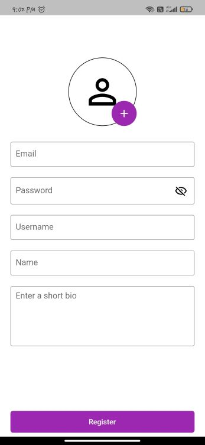
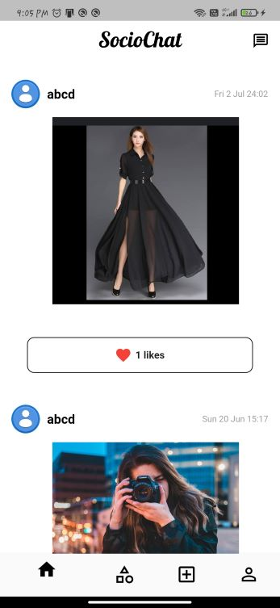
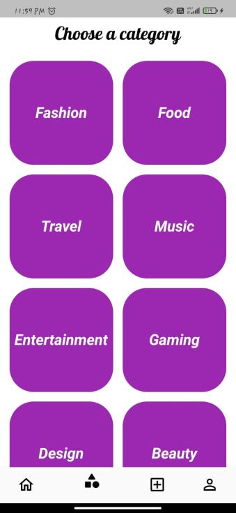
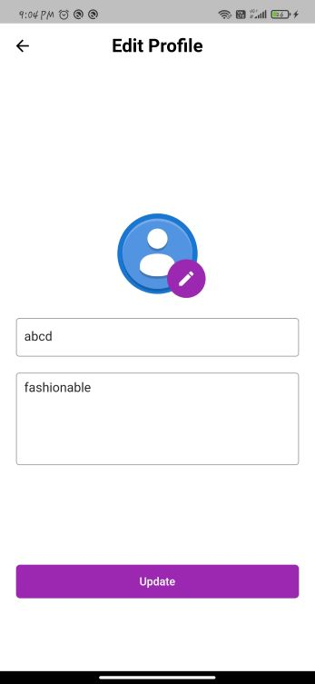

# Sociochat

It is a Flutter application made for users to chat and interact with people having interests same as theirs. Users can post whatever they want and can see posts of whichever category they are interested in. Its UI is inspired by Instagram.

## Features

- Users can create posts under various categories
- Allows users to search other users, chat with them and view their posts and profile
- Users can see posts created by different users in various categories
- Users can also chat with other users through separate shoutouts in all categories
- Feed page that show all posts sorted with time
- Users can like others posts

### Screenshots 

#### Login 

#### Register 

#### Feed Page 

#### Search for an user

#### Chat with user 

#### Categories Page 

#### Posts of individual category 

#### Category ShoutOut 

#### Create Post 

#### User Profile 

#### Edit Profile 

